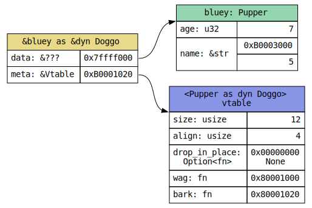
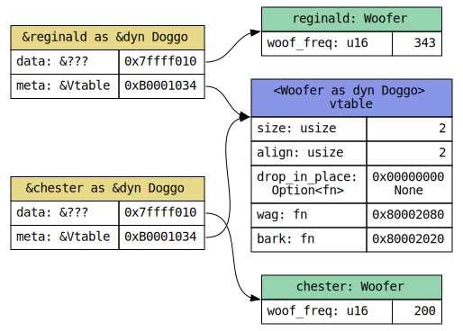
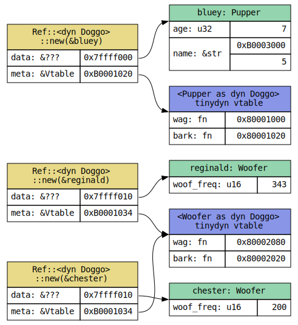
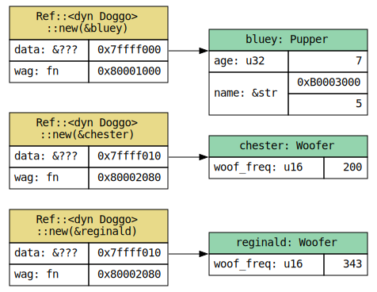

# `tinydyn`

Lightweight dynamic dispatch, intended for embedded use.

`Ref<dyn Trait>` and `RefMut<dyn Trait>` wrap a pointer and metadata necessary to call
trait methods, and `Deref` into a _tinydyn trait object_ that implements the `Trait`.

Traits must currently opt-in by annotating with `#[tinydyn]`.
This defines an alternate, lighter weight [vtable], and if the trait has one method, eliminates
it entirely by putting the function pointer inline.
This does not affect normal behavior of the trait, and can still be made into a `dyn Trait`.
This, however, would be wasteful.

[vtable]: https://en.wikipedia.org/wiki/Virtual_method_table

## Example

```rust
use tinydyn::{tinydyn, Ref};

#[tinydyn]
trait Foo {
    fn blah(&self) -> i32;
    fn blue(&self) -> i32 { 10 }
}
impl Foo for i32 {
    fn blah(&self) -> i32 { *self + 1 }
}

// Like upcasting to `&dyn Foo`, but with a lighter weight vtable.
let x: Ref<dyn Foo> = Ref::new(&15);
assert_eq!(x.blah(), 16);
assert_eq!(x.blue(), 10);
```

## Space Savings

TODO: numbers on a real large embedded project

For every trait and concrete type which upcasts into that trait, Rust creates a new vtable.
Each vtable includes 3 extra pointer-sized values of layout and drop info.
These aren't needed, so tinydyn's custom vtables do not include them.

In addition, tinydyn places the vtable inline in `Ref[Mut]` if it has only one method.
This saves a dereference when making the virtual call as well as removing the need for a static
vtable to allocate - truly as zero-cost as dynamic dispatch can get!


## Design

### Background

Trait objects in Rust are not fully zero-cost.
In order for one set of code to handle multiple types with
varying sizes, alignments, and behaviors, Rust must include extra
metadata with the erased type to be able to work with it.

Say we have a trait `Doggo` with two methods:

```rust
trait Doggo {
    fn wag(&self);
    fn bark(&self);
}
```

A concrete type can implement that trait by defining the necessary methods.
Each of these methods knows the concrete type at compile time.

```rust
struct Pupper {
    age: u32,
    name: &'static str,
}

impl Doggo for Pupper {
    fn wag(&self) { /* wag when self.name heard */ }
    fn bark(&self) { /* yip based on self.age */ }
}

struct Woofer {
    woof_freq: u16,
}

impl Doggo for Woofer {
    fn wag(&self) { /* big woofer wagging */ }
    fn bark(&self) { /* release a woof at self.woof_freq */ }
}
```

To work with multiple types that implement `Doggo` with the same
code, generics can be used. A `fn take_doggo(x: &impl Doggo)` will
create a copy of `take_doggo` for every concrete type passed in,
and at compile time, this copy knows how the type is laid out in memory,
how to call the needed `Doggo`, and how to best inline.

When you only have one copy or the code is trivial, this
[monomorphization] is the best, as the compiler has the most information available to it.

[monomorphization]: https://rustc-dev-guide.rust-lang.org/backend/monomorph.html

If you need one copy of code to deal with multiple types,
we can _erase_ some of this compile-time information.
A `fn take_doggo(x: &dyn Doggo)` works with a reference to a
_trait object_, a [dynamically-sized type][dst] that holds the needed info for
Rust to work with it. This function trades some indirection and more
challenging inlining with only needing one copy of `take_doggo`.

Say we have a `bluey: Pupper` (`bluey` is a value with type `Pupper`).
When we upcast `&bluey` to a `&dyn Doggo`, we erase its type through
an [unsizing coercion]. This unsizing coercion tacks on an extra
pointer to a _vtable_, a table that defines runtime-accessible type
information specific to the trait, most notably the method addresses.
This creates a wide pointer, like how `&[T]` carries a pointer and a length.


[dst]: https://doc.rust-lang.org/nomicon/exotic-sizes.html#dynamically-sized-types-dsts
[unsizing coercion]: https://doc.rust-lang.org/reference/type-coercions.html#unsized-coercions



Multiple `&dyn Doggo` of the same concrete type can share the same vtable.



### Motivation

There's three pointer-sized values that are always included, but aren't used for
dynamic dispatch, but instead for other type-erased operations:

- `size`, which is used by [`mem::size_of_val`], for deallocation, and for
  type layout inside custom DSTs.
- `align`, which is used by [`mem::align_of_val`], for deallocation, and for
  type layout inside custom DSTs.
- The drop glue, which is optional and is essentially [`drop_in_place`] for the
  concrete type. Only needed to dynamically drop a type, like `Box<dyn Trait>`.

[`drop_in_place`]: https://doc.rust-lang.org/core/ptr/fn.drop_in_place.html
[`mem::size_of_val`]: https://doc.rust-lang.org/core/mem/fn.size_of_val.html
[`mem::align_of_val`]: https://doc.rust-lang.org/core/mem/fn.align_of_val.html

However, what if your code doesn't need any of this? If all you need is dynamic
dispatch through an borrow and have no need for accurate layout information,
these values are an unnecessary bloat that pile up on an embedded system.

### `tinydyn` vtables

`tinydyn` defines lighter-weight dynamic dispatch objects through a `#[tinydyn]`
macro on a trait. This defines an alternative vtable format and reference
wrappers to call these methods. This wrapper can't query the runtime layout
information about the concrete type, nor can it drop it. However, it can
call trait methods.



### Inline vtable

`tinydyn` optimizes one step further for traits with one method:
it includes the function pointer for that method alongside the erased
type instead of using a static vtable. This is as cheap as this scheme
of dynamic dispatch can be, and is how one might implement it in C.




### Double Pointer
For safety reasons, the unsized trait object that `Ref`/ `RefMut` deref into is a
pointer to the trait object, creating a double pointer to the object. So, while you _can_ turn
them into a `&(impl Trait + ?Sized)`, that will be marginally larger code size if not optimized.

### Why can't `dyn Trait` be made smaller as an optimization?

In theory, `rustc` could identify that a trait object's size, align, and drop glue are never
accessed throughout the whole program and remove them from the vtable, possibly even inlining
the vtable as tinydyn does. However, rustc is averse to global analysis, preferring to leave
this to LLVM; and LLVM doesn't know how trait object vtables are formatted.

These are requirements tinydyn doesn't have to uphold. It doesn't have a `Box`.

### A trait object that doesn't know its size

Since tinydyn trait objects don't know the size or alignment of what they point to, no
reference to the concrete type can be made while the type is erased.

So, in order for the tinydyn trait object to implement a trait, the implementer itself has to
have an erased pointer type. If that pointer type is sized, however, that comes with its own set
of issues. You can [swap] two `Sized` references, and trait object-unsafe
functions marked with `where Self: Sized` are now available to call, even though there's no
possible implementation.

[swap]: https://doc.rust-lang.org/core/mem/fn.swap.html

tinydyn trait objects do this with a specific design:
- They're primarily referenced through the [`Ref`] and [`RefMut`] types, which hold the data
pointer and metadata needed to call trait methods with no overhead.
- These don't implement the trait, but `Deref` into a `!Sized` wrapper object that does,
called the *dyn wrapper*.
- The dyn wrapper holds same pointer as the `Ref[Mut]`,
so the `Deref` creates a double reference to avoid creating a direct reference to the target.
- The deref wrapper object is discouraged from being used through reference like trait objects
normally are. Not only does it have an inaccurate `size_of_val` and `align_of_val`, it is
a double pointer and is more expensive to use directly.
- The vtable-calling functions are marked `#[inline(always)]` so the double pointer created
when calling trait methods is detected as unnecessary and optimized away by LLVM.

This fake layout and double dereference is, in the end, a necessary design decision for
soundness.

### Function pointer `transmute`

In order to avoid the generation of duplicate functions or multiple addresses for the same method,
this library performs an `unsafe` transmute of a function item cast to `*const ()` into a
"`&self`-erased" `fn` pointer. This is the most problematic operation it performs. It makes these
assertions about unsafe Rust:

- There is no layout difference between `&'a T` where `T: Sized` and `*const ()`. These pointers can
  be soundly transmuted between each other for the lifetime `'a`. Similarly for `&mut` and
  `*mut ()`.
- Lifetimes are _entirely_ transparent to function call ABI.
- A function item cast to `*const ()` can soundly be transmuted to a function pointer if:
  - All parameters have identical layout.
  - All pointer parameters have the same mutability.
  - Function pointers are the size of `*const ()` on this platform
    (checked by `transmute`).


## Contributing

See [`CONTRIBUTING.md`](CONTRIBUTING.md) for details.

## License

Apache 2.0; see [`LICENSE`](LICENSE) for details.

## Disclaimer

This project is not an official Google project. It is not supported by
Google and Google specifically disclaims all warranties as to its quality,
merchantability, or fitness for a particular purpose.